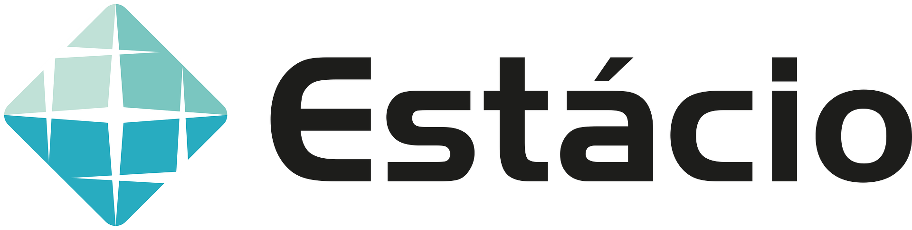

## Estácio - Mundo 5 - Missão Nível 4

- Faculdade Estácio - Polo Curitiba - Centro
- Curso: Desenvolvimento Full Stack
- Disciplina: Dando inteligência ao software
- Número da Turma: RPG0034
- Semestre Letivo: 5
- Integrante: Mariana Lucas Fernandes Onório
- Repositório: https://github.com/MariLFO/estacio-mundo5-missao-nivel-4

### Relatório discente de acompanhamento:
- [Relatório de acompanhamento](./Miss%C3%A3o%20Pr%C3%A1tica_%20Mundo%205%20-%20N%C3%ADvel%204.pdf)